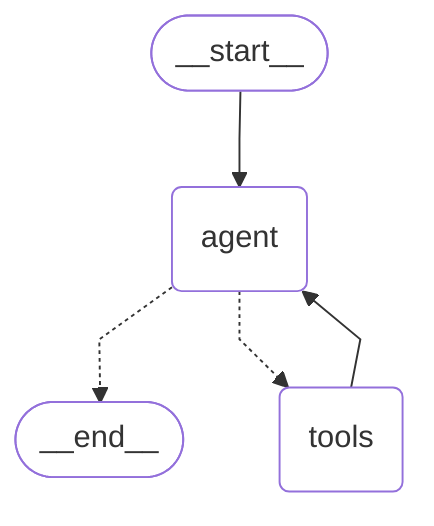

# Agente de exploración de repositorios: manual y con LangGraph

## Resumen

Este proyecto presenta dos formas de construir el mismo agente de exploración de repositorios:

1. **Agente manual**: el ciclo de invocación del modelo, ejecución de herramientas y manejo de resultados se implementa explícitamente en Python.
2. **Agente con LangGraph**: el mismo flujo se modela como un grafo de estado, donde un nodo usa el modelo y otro ejecuta las herramientas.

Ambos agentes utilizan el mismo prompt, el mismo modelo Claude y las mismas tres herramientas: `list_files`, `read_file` y `search_text`.

## Qué se hizo

### 1. Agente manual

El archivo [agent_manual.py](../agent_manual.py) define un ciclo manual para cada pregunta:

1. Envía la pregunta y el historial al modelo.
2. Espera una respuesta de Claude.
3. Si el modelo solicita una herramienta, ejecuta la función correspondiente.
4. Añade el resultado como una herramienta devoluelta al modelo.
5. Repite el proceso hasta obtener una respuesta final o alcanzar el límite de iteraciones.

La función principal es `run_agent()` y contiene el bucle de control:

```python
def run_agent(question):
    messages = [{"role": "user", "content": question}]
    for _ in range(MAX_ITERATIONS):
        resp = client.messages.create(
            model=MODEL,
            max_tokens=1024,
            system=SYSTEM,
            tools=tools,
            messages=messages,
        )
        # ...
```

El archivo [agent_manual.py](../agent_manual.py) también implementa la ejecución directa de herramientas mediante `run_tool()`.

### 2. Agente con LangGraph

El archivo [agent_langgraph.py](../agent_langgraph.py) crea un grafo de estado con dos nodos:

- **agent**: invoca a `ChatAnthropic` con el prompt del sistema y los mensajes actuales.
- **tools**: ejecuta las herramientas disponibles mediante `ToolNode`.

El grafo utiliza `tools_condition` para decidir si después de la respuesta del modelo debe ejecutarse una herramienta o continuar con la respuesta final.

La definición del grafo es:

```python
builder = StateGraph(MessagesState)
builder.add_node("agent", call_model)
builder.add_node("tools", ToolNode(tools))
builder.add_edge(START, "agent")
builder.add_conditional_edges("agent", tools_condition)
builder.add_edge("tools", "agent")
graph = builder.compile()
```

La función `call_model()` envía el mensaje de usuario y el prompt del sistema al modelo:

```python
def call_model(state: MessagesState):
    reply = llm.invoke(
        [SystemMessage(content=SYSTEM)] + state["messages"]
    )
    return {"messages": [reply]}
```

### 3. Herramientas compartidas

El archivo [tools.py](../tools.py) convierte las funciones de [agent_manual.py](../agent_manual.py) en herramientas de LangChain:

- `list_files_tool`: lista archivos y carpetas.
- `read_file_tool`: lee el contenido de un archivo.
- `search_text_tool`: busca texto en los archivos del repositorio.

El prompt compartido está definido en [agent_system.py](../agent_system.py) y establece que el agente debe explorar el repositorio, buscar código y responder de forma concisa.

## Comparación

| Aspecto | Agente manual | Agente con LangGraph |
|---|---|---|
| Ciclo de ejecución | Implementado con un `for` explícito | Gestionado por el grafo |
| Estado de la conversación | Se mantiene en una lista de mensajes | Se administra mediante `MessagesState` |
| Decisión sobre herramientas | Se evalúa en `run_tool()` | Se ejecuta con `tools_condition` |
| Ejecución de herramientas | `run_tool()` manual | `ToolNode` |
| Control del flujo | El desarrollador define el bucle | LangGraph define las transiciones |
| Repetición del agente | Bucle de iteraciones | Bucle de nodos y aristas |
| Modelo | `ChatAnthropic` o API directa | `ChatAnthropic` con herramientas vinculadas |

## Diagrama Mermaid del grafo



## Flujo del grafo

1. El inicio del grafo envía el mensaje del usuario al nodo `agent`.
2. El nodo `agent` consulta al modelo.
3. Si el modelo no solicita herramientas, el flujo termina en `__end__`.
4. Si el modelo solicita herramientas, el flujo pasa al nodo `tools`.
5. El nodo `tools` ejecuta la herramienta requerida.
6. El resultado vuelve al nodo `agent` para continuar la conversación.

## Ejecución

Para ejecutar el agente con LangGraph desde la consola:

```bash
.venv/bin/python agent_langgraph.py
```

Para imprimir únicamente el diagrama Mermaid:

```bash
.venv/bin/python draw_graph_marmaid.py
```

## Conclusión

El agente manual muestra cómo funciona el ciclo de un agente sin depender de un framework de orquestación. El agente con LangGraph organiza ese mismo comportamiento mediante nodos, aristas y estado, lo que permite expresar el flujo de ejecución de forma más declarativa y modular.
